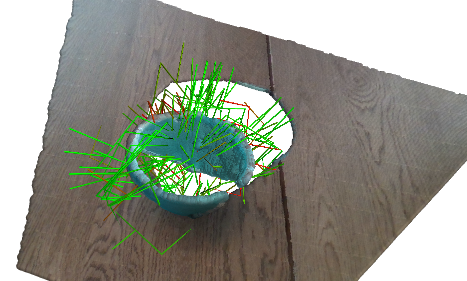
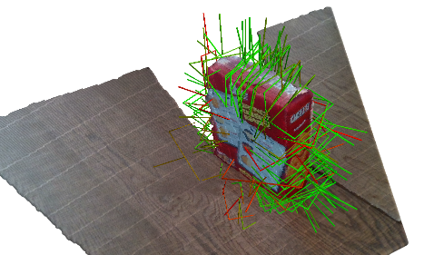

# 6-DoF GraspNet: Variational Grasp Generation for Object Manipulation

This is a PyTorch implementation of [6-DoF
GraspNet](https://arxiv.org/abs/1905.10520). The original Tensorflow
implementation can be found here <https://github.com/NVlabs/6dof-graspnet>.

# License

The source code is released under [MIT License](LICENSE) and the trained weights are released under [CC-BY-NC-SA 2.0](TRAINED_MODEL_LICENSE).

## Installation

This code has been tested with python 3.6, PyTorch 1.4 and CUDA 10.0 on Ubuntu
18.04. (I personally use 3.8.19, pytorch 1.13 and CUDA 11.7) To install do

1) `pip3 install torch==1.13.0+cu117 torchvision==0.14.0+cu117 -f <https://download.pytorch.org/whl/torch_stable.html>`

2) Clone this repository: `git clone
   git@github.com:jsll/pytorch_6dof-graspnet.git`.

3) Clone pointnet++: `https://github.com/erikwijmans/Pointnet2_PyTorch`.

4) Run `cd Pointnet2_PyTorch && pip3 install -r requirements.txt`

5) `cd pytorch_6dof-graspnet`

6) Run `pip3 install -r requirements.txt` to install necessary python libraries.

7) (Optional) Download the trained models either by running `sh
   checkpoints/download_models.sh` or manually from [here](https://drive.google.com/file/d/1B0EeVlHbYBki__WszkbY8A3Za941K8QI/view?usp=sharing). Trained
   models are released under [CC-BY-NC-SA 2.0](TRAINED_MODEL_LICENSE).

## Disclaimer

The pre-trained models released in this repo are retrained from scratch and not converted from the original ones <https://github.com/NVlabs/6dof-graspnet> trained in Tensorflow. I tried to convert the Tensorflow models but with no luck. Although I trained the new models for a substantial amount of time on the same training data, no guarantees to their performance compared to the original work can be given.

## Updates

In the paper, the authors only used gradient-based refinement. Recently, they released a Metropolis-Hastings
sampling method which they found to give better results in shorter time. As a result, I keep the Metropolis-Hastings sampling as the default for the demo.

This repository also includes an improved grasp sampling network which was
proposed here <https://github.com/NVlabs/6dof-graspnet>. The new grasp sampling
network is trained with [Implicit Maximum Likelihood Estimation](https://arxiv.org/pdf/2004.03590.pdf).


## Demo

Run the demo using the command below

```shell
python -m demo.main
```

Per default, the demo script runs the GAN sampler with sampling based
refinement. To use the VAE sampler and/or gradient refinement run:

```shell
python -m demo.main --grasp_sampler_folder checkpoints/vae_pretrained/ --refinement_method gradient
```

 

## Dataset

### Get ShapeNet Models

Download the meshes with ids written in [shapenet_ids.txt](shapenet_ids.txt) from <https://www.shapenet.org/.> Some of the objects are in `ShapenetCore` and `ShapenetSem`.

### Prepare ShapeNet Models

1. Clone and build: <https://github.com/hjwdzh/Manifold>
2. Create a watertight mesh version assuming the object path is model.obj: `manifold model.obj temp.watertight.obj -s`
3. Simplify it: `simplify -i temp.watertight.obj -o model.obj -m -r 0.02`

### Download the dataset

The dataset can be downloaded from [here](https://drive.google.com/open?id=1GkFrkvpP-R1letnv6rt_WLSX80o43Jjm). The dataset has 3 folders:

1) `grasps` folder: contains all the grasps for each object.
2) `meshes` folder: has the folder for all the meshes used. Except `cylinder` and `box` the rest of the folders are empty and need to be populated by the downloaded meshes from shapenet.
3) `splits` folder: contains the train/test split for each of the categories.


## Training

To train the grasp sampler (vae or gan) or the evaluator with bare minimum configurations run:

```shell
python3 train.py  --arch {vae,gan,evaluator}  --dataset_root_folder $DATASET_ROOT_FOLDER
```

where the `$DATASET_ROOT_FOLDER` is the path to the dataset you downloaded.

To monitor the training, run `tensorboard --logdir checkpoints/` and click <http://localhost:6006/>.

For more training options run
GAN Training Example Command:

```shell
python3 train.py  --help
```

# Dataset DA2

Similar structure, can be downloaded from [here](https://drive.google.com/file/d/1Gb247xnwxbiy2psliTbu5DjMAi7pbBzn/view?usp=sharing).:
1) `grasps` folder: contains all the grasps pairs for each object.
2) `meshes` folder: has the folder for all the meshes used, not organized by object type like with the shapenet data
3) `splits` folder: contains the train/test split for each of the categories.

These three folders should be present under `shapenet_models/da2_dataset_small/`

## Training Dual grasp

To train the grasp sampler (vae) with a configuration that works on a gpu with 8GB vram run:

```shell
python3 train.py  --arch vae  --dataset_root_folder shapenet_models/da2_dataset/  --num_grasps_per_object 32 --niter 1000 --niter_decay 10000 --save_epoch_freq 50 --save_latest_freq 250 --run_test_freq 10 --dual_grasp True
```

To look at the performance after training run"

```shell
python -m demo.main --grasp_sampler_folder checkpoints/vae_lr_0002_bs_32_scale_1_npoints_128_radius_02_latent_size_2/ --refinement_method gradient --dual_grasp
```

## DA2 Dataset Issue

When converting the meshes to pointcloud the resulting pointcloud is shifted. The creation of the pointcloud occurs in `renderer/online_object_renderer.py`. Specifically in the `to_pointcloud()` function on line `96`.
In `models/grasp_net.py` on lines `62-79` the resulting pointclouds and it grasps are visualized. Commenting these lines shoud result in the training script running normally.


